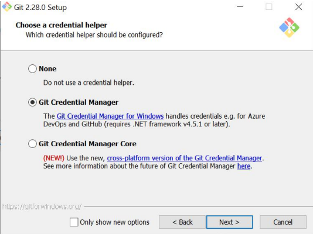

Latihan Instalasi GIT di windows
Sebelum install Git di Windows, anda harus sudah mempunyai editor teks yang didukung oleh Windws. Editor yang bisa dipilih banyak, tetapi disarankan menggunakan Notepad++ atau Visual Studion Code atau Vim.

1. Setelah selesai mendownload Git, lalu double click pada file yang telah di download. Kemudian muncul lisensi. Klik next untuk melanjutkan.

2. Setelah itu, pilih lokasi instalasi. Secara default akan terisi C:\Program Files\Git. Ganti lokasi jika memang anda menginginkan lokasi lain, klik Next.

3. Pilih komponen. Tidak perlu diubah-ubah, sesuai dengan default saja. Klik pada Next.

4. Mengisi shortcut untuk menu Start. Gunakan default (Git), ganti jika ingin mengganti - misalnya Git VCS.

5. Pilih editor yang akan digunakan bersama dengan Git. Pada pilihan ini, digunakan Notepad++.

6. Pada saat instalasi, Git menyediakan akses git melalui Bash maupun command prompt. Pilih pilihan kedua supaya bisa menggunakan dari dua antarmuka tersebut. Bash adalah shell di Linux. Dengan menggunakan bash di Windows, pekerjaan di command line Windows bisa dilakukan menggunakan bash - termasuk ekskusi dari Git.

7. Pilih OpenSSL untuk HTTPS. Git menggunakan https untuk akes ke repo GitHub atau repo-repo lain (GitLab, Assembla).

8. Pilih pilihan pertama untuk konversi akhir baris (CR-LF).

9. Pilih PuTTY untuk terminal yang digunakan untuk mengakses Git Bash.

10. Untuk opsi ekstra, pilih yang bagian atas.

11. Pilih default untuk git pull, pilih yang default.

12. Pilih bantuan mandat, pilih Git credential Manager.

13. Uncheck opsi konfigurasi experimental.

14. Setelah itu proses instalasi akan dilakukan.

15. Jika selesai akan muncul dialog pemberitahuan. Klik pada Finish.

16. Untuk menjalankan, dari Start menu, ketikkan "Git", akan muncul beberapa pilihan. Pilih "Git Bash" atau "Git GUI”.

17. Tampilan jika akan menggunakan "Git Bash".

18. Tampilan jika akan menggunakan "Git GUI".

19. Untuk mencoba dari command prompt, masuk ke command prompt, setelah itu eksekusi "git --version" untuk melihat apakah sudah terinstall atau belum.

Konfigurasi GIT

Secara minimal, user harus memberitahu Git tentang username serta email yang digunakan setiap kali terjadi perubahan pada repo Git.
Username serta email ini yang akan dimasukkan oleh Git ke catatan perubahan di repo.
Di sistem operasi Linux atau sejanis (UNIX), konfigurasi ini nantinya akan disimpan di $HOME/.gitconfig.
Untuk sistem operasi Windows, konfigurasi ini akan disimpan di C:\Document and Settings\NamaUser dengan nama file .gitconfig.
Secara minimal, ada 2 hal yang perlu dikonfigurasi yaitu username dan email. Gunakan perintah berikut:

Isian di atas harus disesuaikan dengan nama serta email yang digunakan untuk mendaftar di GitHub.