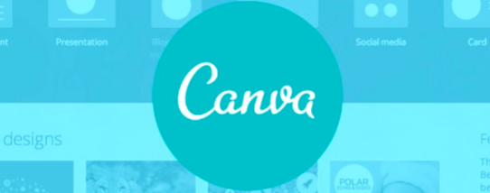

# Layanan SAAS

## 1. Cloud : Canva

Canva adalah sebuah tools untuk desain grafis yang menjembatani penggunanya agar dapat dengan mudah merancang berbagai jenis desain kreatif secara online. Mulai dari mendesain kartu ucapan, poster, brosur, infografik, hingga presentasi. Canva saat ini tersedia dalam beberapa versi, web, iPhone, dan Android.

## Non Cloud : yEd Graph Editor

yEd-Graph Editor adalah aplikasi untuk membuat diagram-diagram yang biasa digunakan dalam perancangan sistem informasi seperti Flowchart, ER-D, DFD dan lain sebagainya. Aplikasi ini tersedia untuk Windows, Linux dan juga MacOS. Selain itu aplikasi ini sangat mudah digunakan bagi siapa saja tak terkecuali untuk pemula.
Selain aplikasi ini gratis, yEd-Graph Editor juga menyediakan banyak sekali grafis serta kita dimudahkan dengan dapat mewarnai pada setiap shape-shape nya. Diagram yang telah kita buat dapat diekspor ke format SWF, SVG, PDF, HTML, PNG dan lain sebagainya.

## 2. Cloud : Google Drive

Google Drive adalah layanan penyimpanan berbasis cloud gratis yang memungkinkan pengguna untuk menyimpan dan mengakses file secara online. Layanan ini menyinkronkan dokumen, foto, dan lainnya yang tersimpan di semua perangkat pengguna, termasuk perangkat seluler, tablet, dan PC.
Google Drive adalah layanan penyimpanan cloud, dan apa fungsi Google Drive yang utama adalah untuk melepaskan sebagian beban dari hard drive Anda. Penyimpanan
cloud bekerja dengan mengunggah file ke server jarak jauhnya sendiri (atau “cloud”) dan mengosongkan ruang di komputer Anda. Ini akan membantu menyisakan lebih banyak ruang di perangkat Anda untuk hal-hal yang lebih penting, seperti aplikasi dan game besar.

## Non Cloud : (SSD)

SSD adalah singkatan dari Solid State Drive, yaitu sebuah piranti penyimpanan yang menggunakan flash memory untuk menyimpan datanya. Dari semua storage device yang telah muncul ternyata tidak semuanya mampu bertahan hingga sekarang. Bahkan biasanya setiap muncul yang baru maka yang lama tidak akan dipakai lagi.
SSD mempunyai beberapa kelebihan, salah satunya adalah daya tahan baterai. SSD lebih sedikit dalam pemakaian baterai jika dibandingkan dengan HDD. Selanjutnya mengenai kecepatan booting pada sistem operasi, rata-rata booting untuk SSD sekitar 10-13 detik, sedangkan untuk HDD sekitar 30-40 detik.