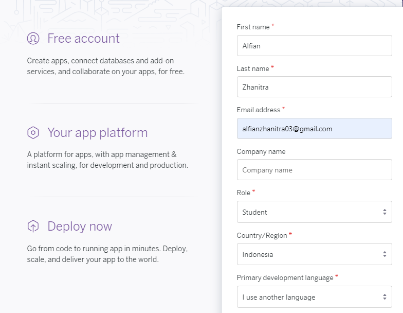
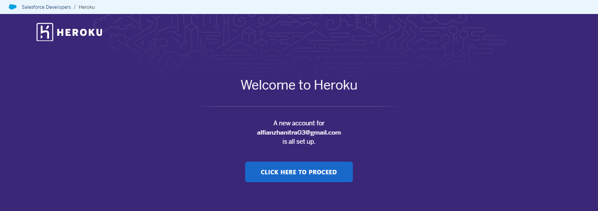
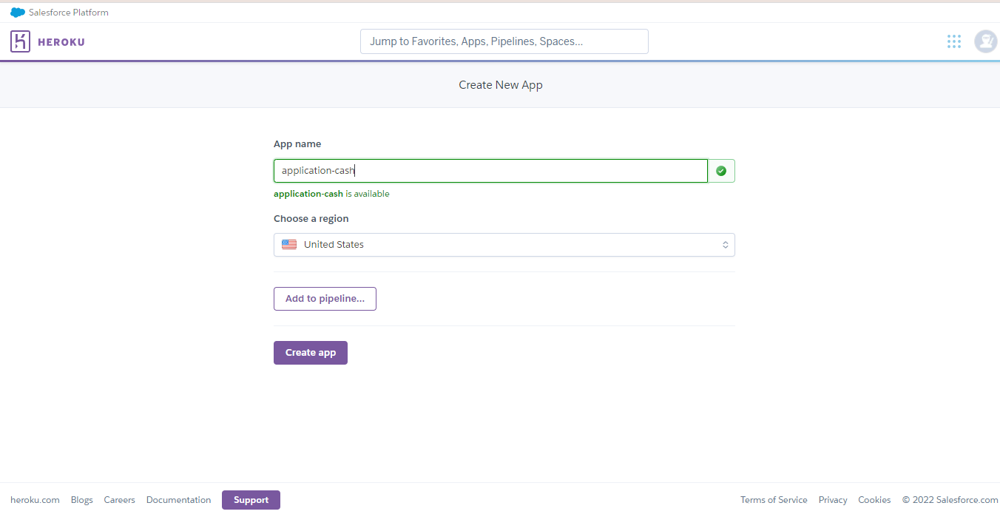
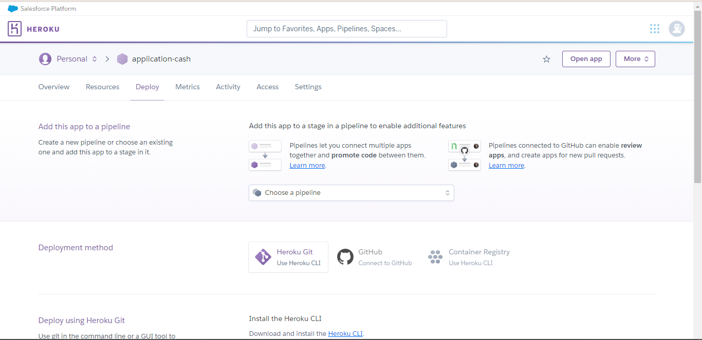
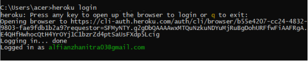
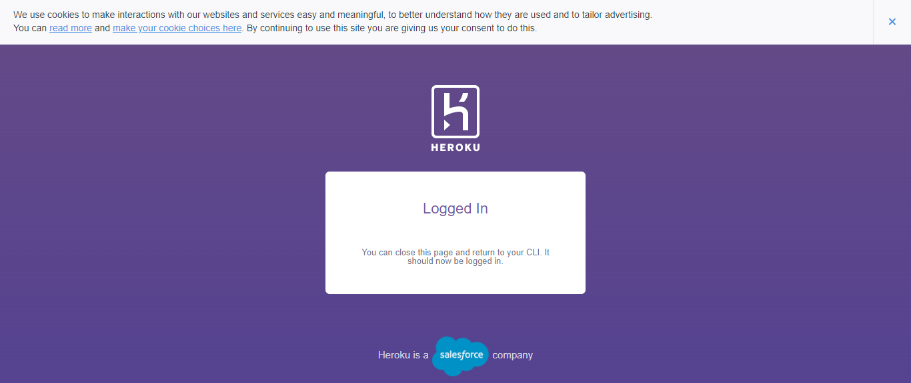
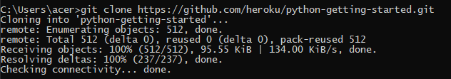

## LATIHAN

Sign Up ke Hiroku

Buat aplikasi baru melalui dashboard

Dari perintah diatas apabila sudah mengisi perintah "heroku login", maka secara otomatis akan lansung terhubung ke web heroku yaitu halaman login.

Git Clone
Pada bagian ke-3 ini dilakukan proses clonning dari git heroku untuk mengambil repo "python-getting-started" ke bash lokal komputer.

