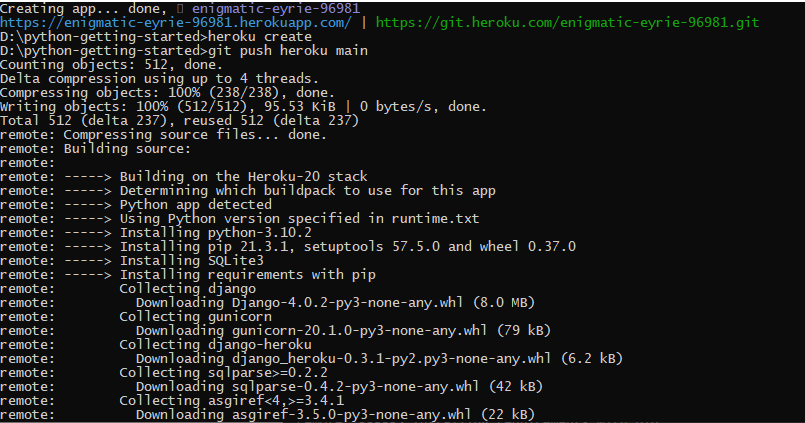
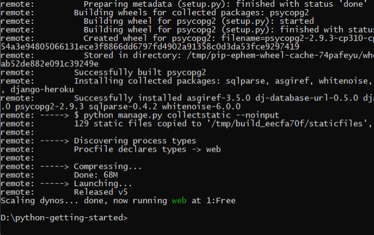
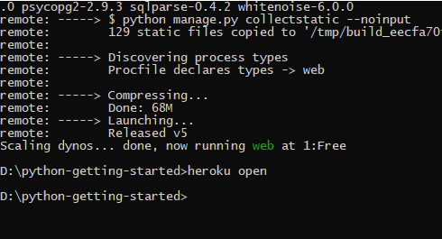
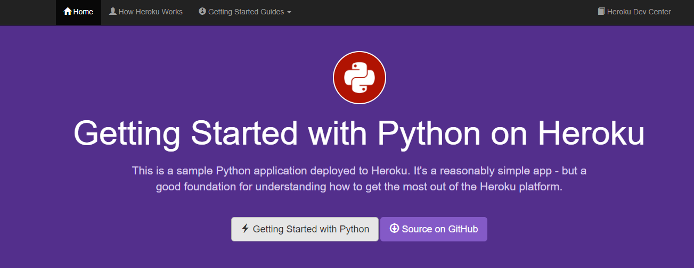
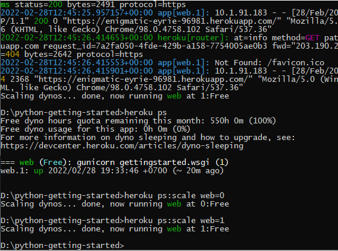
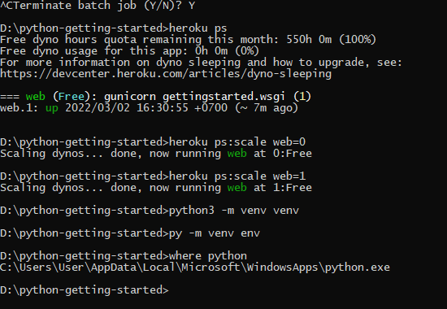

## LATIHAN

Sign Up ke Hiroku

Buat aplikasi baru melalui dashboard

Dari perintah diatas apabila sudah mengisi perintah "heroku login", maka secara otomatis akan lansung terhubung ke web heroku yaitu halaman login.

Git Clone
Pada bagian ke-3 ini dilakukan proses clonning dari git heroku untuk mengambil repo "python-getting-started" ke bash lokal komputer.

Selanjutnya masuk pada repo lokal yang baru di push dan kemudian melakukan initialisasi repo lokal yang baru di clonning tersebut. Setelah melakukan initialisasi tersebut maka langkah selanjutnya melakukan remote ke app yag sudah di create sebelumnya pada akun heroku, ini beguna untuk bisa terhubung ke app pada heroku.

Kemudian selanjutnya melakukan konfiguasi pada web scale dengan nilai konfigurasinya 1, apabila 1 maka app yang di create pada heroku dapat diakses, dan kemudian untuk membukanya dengan menggunakan perintah "heroku open".

Pada bagian pertama menampilkan berapa dyno free yang dipakai oleh kita, dyno yang digunakan disini mempunyai batasan kerena menggunakan dyno yang free.
dan kemudian perintah dibawahnya untuk melihat web akses kita, apabila bernilai 0 maka web akses kita tidak ada, dan apabila dijalankan pada web browser akan menampilkan error.
Sehingga yag harus digunakan yaitu web scale yang bernilai 1 untuk dapat mengakses web kita.

