# TUGAS

1. Kerjakan deployement ke PaaS di Heroku untuk PHP.
Untuk proses berikutnya akan melakukan login pada heroku, disini saya menggunakan command prompt untuk melakukan penagaksesan heroku.

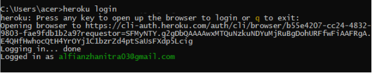

Dari perintah diatas apabila sudah mengisi perintah "heroku login", maka secara otomatis akan lansung terhubung ke web heroku yaitu halaman login.

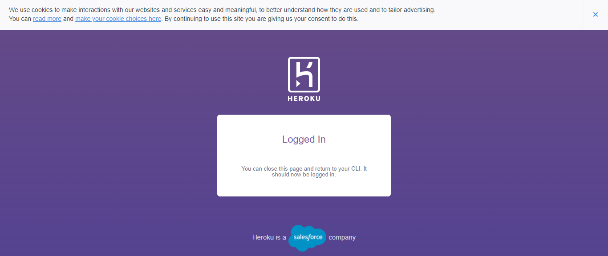

2. Selanjutnya mengecek versi dari php, composer dan git dari komputer local yang sebelumnya sudah diinstal.

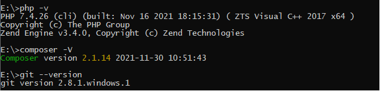

3. Pada bagian ke-3 ini dilakukan proses clonning dari git heroku untuk mengambil repo "php-getting-started" ke bash lokal komputer dan masuk ke repo lokal yang baru di clonning, dan kemudian selanjutnya membuat app bauru kita pada heroku.

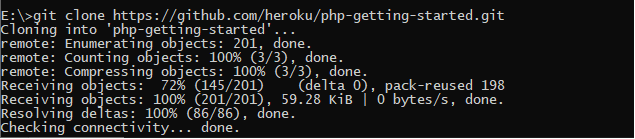

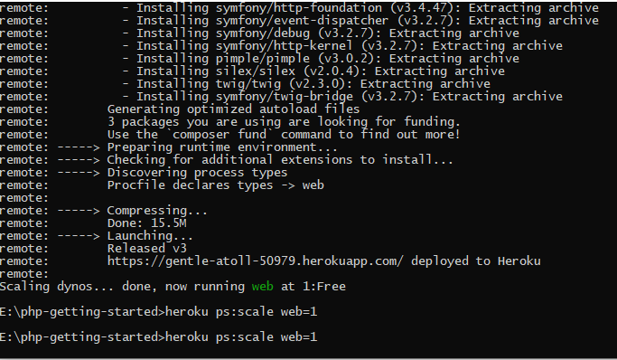

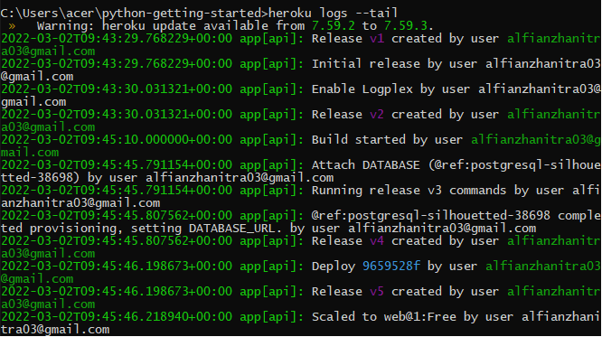

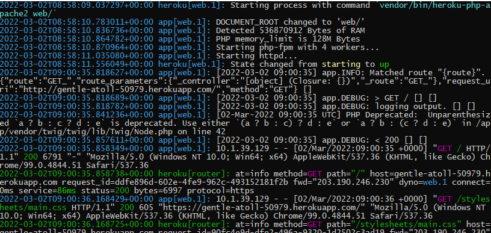

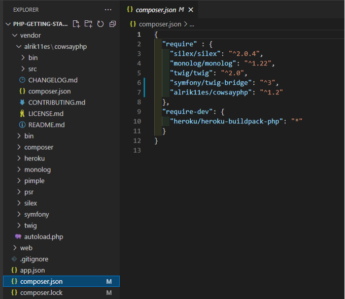

4. Kemudian selanjutnya melakukan update composer, dari bash commmand git

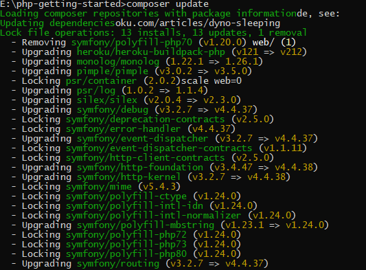

Sehingga hasil yang di tampilkan pada repo lokal yang di conning sebelumnya, dimana pada direktori vendor akan terdapat file autoload.php dari hasil update composer tersebut.

5. Selanjutnya dari hasil update composer tersebut masih memerlukan direktori arlik11es dan didalamnya akan di install atau ditambahkan direktori cowsayphp, dan kemudian baru dilakukan update composernya lagi.

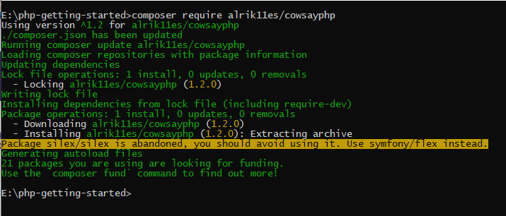

6. Kemudian selanjutnya melakukan perubahan pada file index.php yang terdapat pada direktori web pada repo lokal hasil clonning sebelumnya.

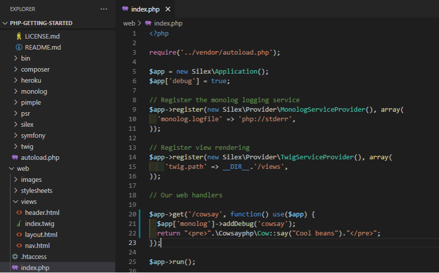

7. Dan selanjutnya dilakukan push pada app heroku kita

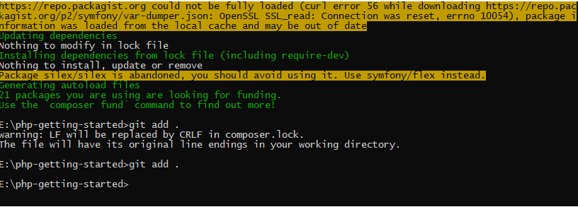

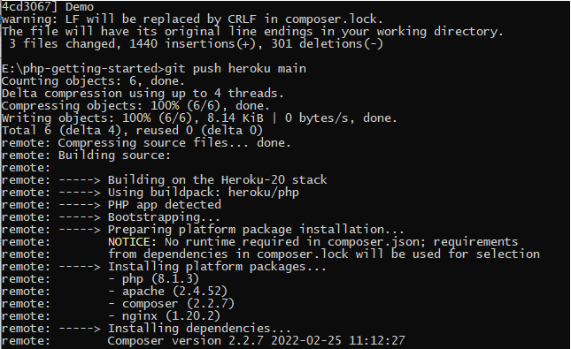

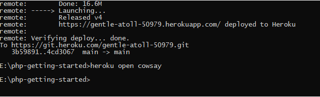

Sehingga hasil yang ditapilkan pada halaman url app heroku kita, seperti pada gambar dibawah ini:

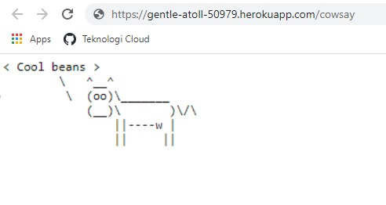

Selanjutnya kita buat seperti ini.

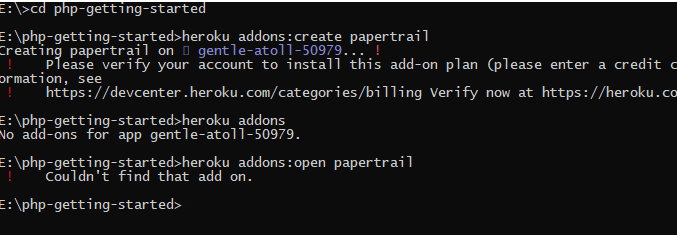

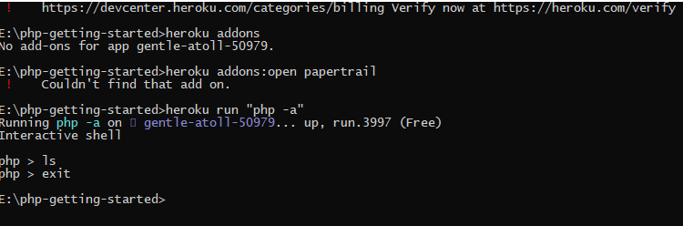