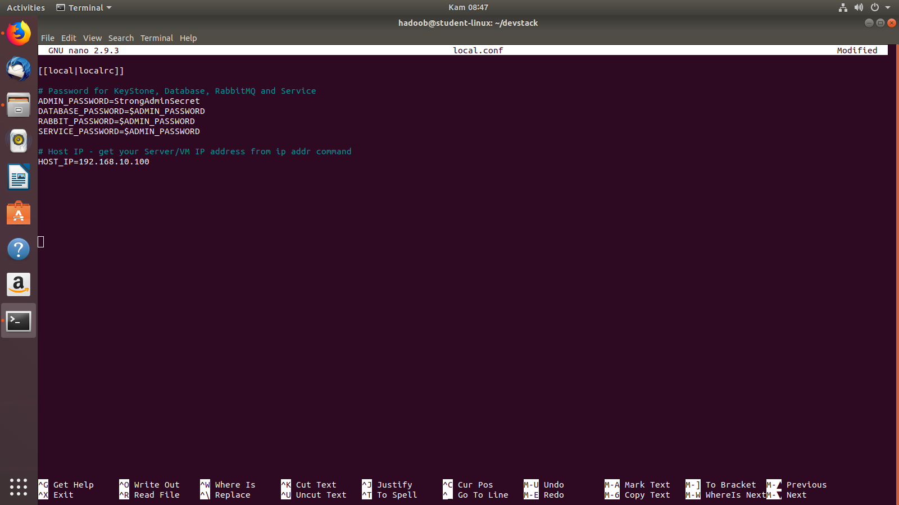
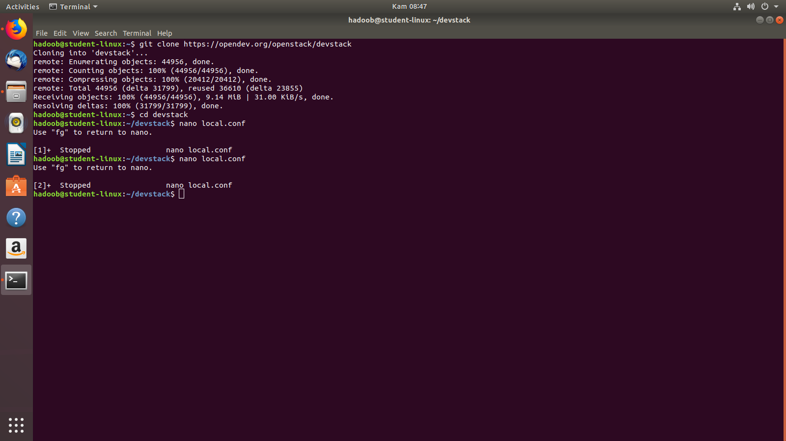
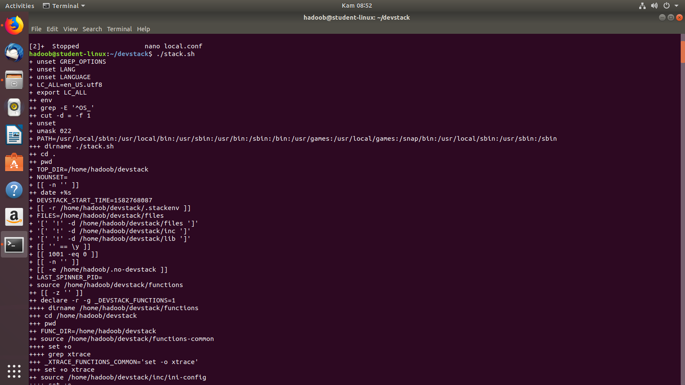
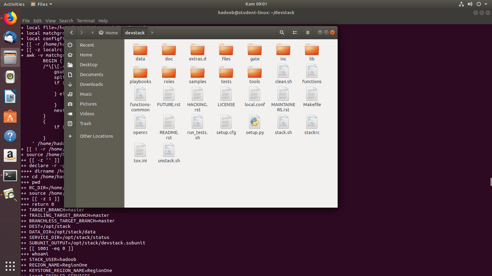

# Infrastructure as a Service dan SDN

## LATIHAN

1. Pada bagian yang pertama, kita akan melihat atau mengecek hak akses user atau pengguna.
User atau pengguna akan melakukan hak akses penuh terhadap sistem ini.

2. Lalu dilakukan proses clonning repo devstack dan kemudian masuk pada direktori devstack kemudian membuat file local.conf untuk melihat password untuk hak akses ke repo devstack.

3. Kemudian akan melakukan proses instalasi devstack.

Proses instalasi ini akan memakan waktu yang cukup lama, dan bergantung pada koneksi internet yang tersedia. dikarenakan pada git terdapat banyak file yang diinstall selama proses ini.

4. Terakhir, kita akan melihat hasil instalasi file local.conf, apabila proses instalasi berhasil maka file local.conf akan secara otomatis masuk pada direktori devstack.

