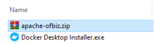
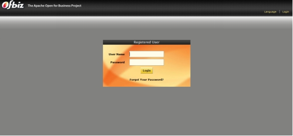

# Latihan

## Install dan Menjalankan Apache OFBiz

Apache OFBiz adalah sistem perencanaan sumber daya perusahaan sumber terbuka. Apache OFBiz menyediakan seperangkat aplikasi perusahaan yang mengintegrasikan dan mengotomatisasi banyak proses bisnis suatu perusahaan. OFBiz adalah proyek tingkat atas Apache Software Foundation.

1. Download dan extract file Apache OFBiz.

2. Pastikan java sudah terinstall.
   Cek instalasi java menggunakan command prompt.

3. Buka command prompt, kemudian masuk ke direktori instalasi ofbiz.
   Masukkan perintah “init-gradle-wrapper” untuk mendownload gradle wrapper.

Kemudian masukkan perintah “gradlew cleanAll loadAll” dan tunggu hingga proses load selesai.

4. Masukkan perintah “gradlew ofbiz” untuk menjalankan ofbiz.

5. Uji coba server local ofbiz dengan cara mengakases server local ofbiz melalui alamat https://localhost:8443/demo.

Lakukan proses login, kemudian akan muncul tampilan berikut

