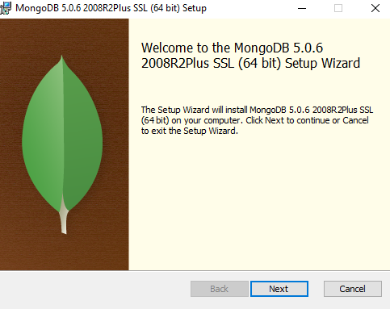
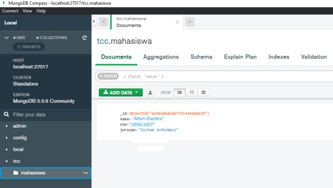

# LATIHAN

## A. Implementasi Program Go Untuk Membaca Data Pada MySQL

1. Download dan install program GO.

2. Download dan install MongoDB

3. Buat Connection to PHP MySQL :
- Buat direktori “ mkdir project-pertama”
- Masuk ke direktori “cd project-pertama”
- Untuk membuat go.mod ketik “go init project-pertama”
- Cek file terlebih dahulu ketik “dir”

4. Setting path variabel

5. Sinkronisasi koneksi mysql
a) Instalasi driver terlebih dahulu ketik “ go get github.com/go-sql-driver/mysql”
b) Buat database dan tabel di MySQL

6. Buat file main.go untuk dijalankan

7. Buat kode koneksi ke mysql seperti berikut :

8. Jalankan program dengan memasukkan perintah “go run main.go”.

## B. Implementasi Program Go Untuk Membaca Data Pada MongoDB

1. Download dirver mongodb

2. Kemudian buat database baru pada mongodb compass dengan nama tcc dan didalamnya dibuat collection dengan nama mahasiswa.

3. Selanjutnya membuat program go untuk melakukan koneksi ke database dengan melakukan remote ke mongodb server dan kemudian mengekusinya dan melakukan baca data dari database dan collection

- Koneksi

- Membaca data MongoDB

Sehingga hasil yang ditampilkan ketika melakukan eksekusi terhadapat program koneksi dan baca data mongodb, akan menghasilkan output seperti pada ambar dibawah ini:

a. Output untuk program koneksi:

b. Output untuk Program Membaca Data MySql :

