# LATIHAN

1. Proses instalasi docker dekstop

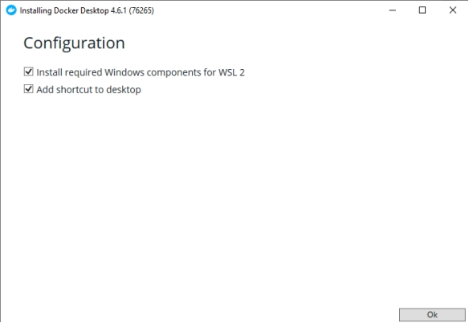

Tunggu sampai proses instalasi selesai. Apabila sudah selesai maka selanjutnya klik	finish.

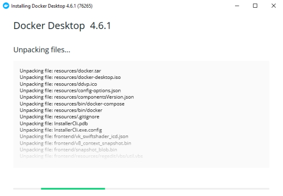

2. Selanjutnya masuk pada command prompt lalu jalankan perintah berikut :

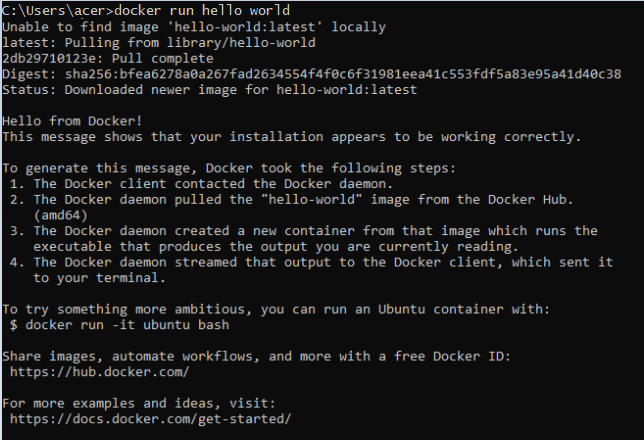

3. Build and run image

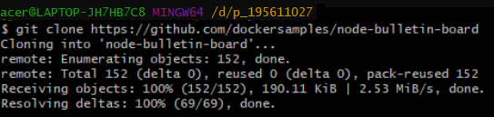

//mengcloning repo berdasarkan url
$ git clone https://github.com/dockersamples/node-bulletin-board

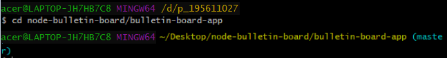

//berpindah direktori
$ cd node-bulletin-board/bulletin-board-app

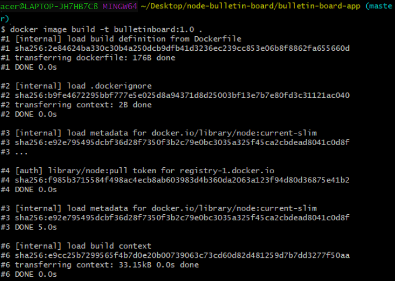

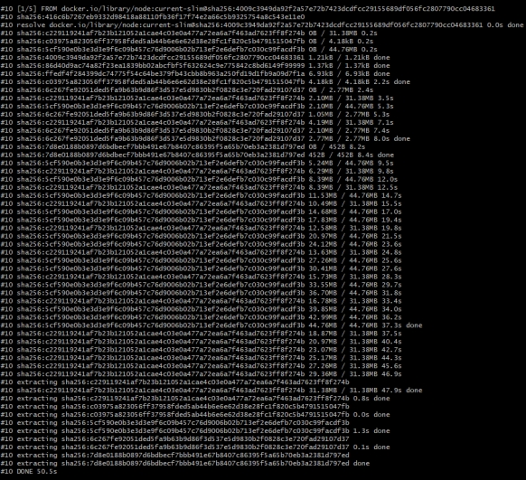

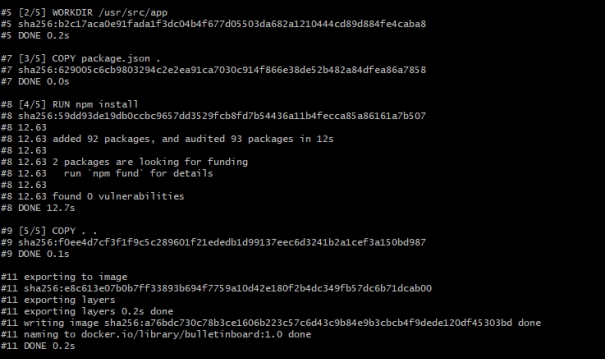

//build image docker
$ docker image build -t bulletinboard:1.0

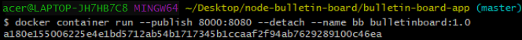

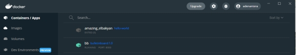

menjalankan container untuk melihat docker image nantinya secara local yakni pada localhost:8000

4. Share image on Docker Hub

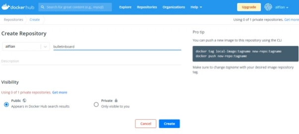

Buat akun docker hub terlebih dahulu, jika sudah kita membuat repo baru dengan nama bulletinboard.

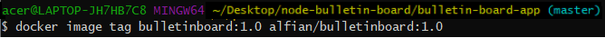

//share image kita ke docker hub
$docker image tag bulletinboard:1.0 soholeh/bulletinboard:1.0

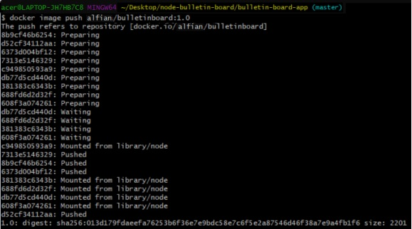

//push image kita ke docker hub
$docker image push soholeh/bulletinboard:1.0

Untuk melihat hasilnya kita dapat membuka tab baru dan isikan url dengan localhost:8000

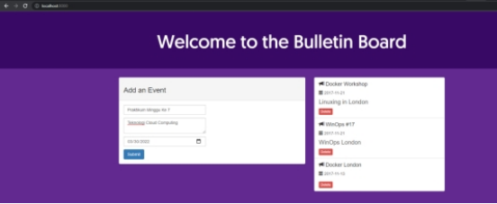