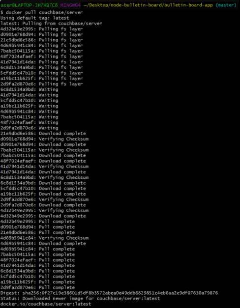
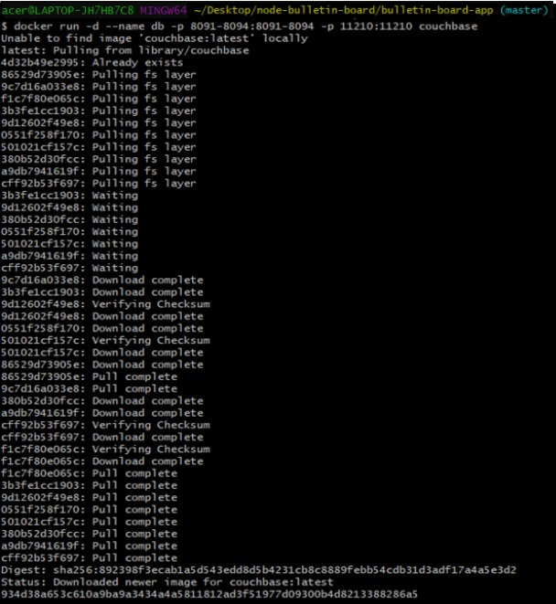
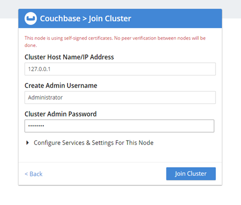

# TUGAS

1. Couchbase image from DockerHub
pull library couchbase, jalankan perintah $ docker pull couchbase

run couchbase Server docker container kemudian jalankan $ docker run -d --name db
-p 8091-8094:8091-8094 -p 11210:11210 couchbase

2. Buka http://localhost:8091 untuk melihat hasilnya

