# LATIHAN

1. Membuat direktori proyek

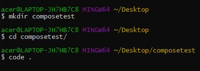

Jalankan perintah $ mkdir composetest pada git bash seperti gambar diatas untuk membuat folder baru dengan nama composetest.
Jalankan perintah $ cd composetest/ pada git bash seperti gambar diatas untuk berpindah ke folder composetest.
Jalankan perintah $ code pada git bash seperti gambar diatas untuk membuka code editor vscode.

2. Membuat file app.py

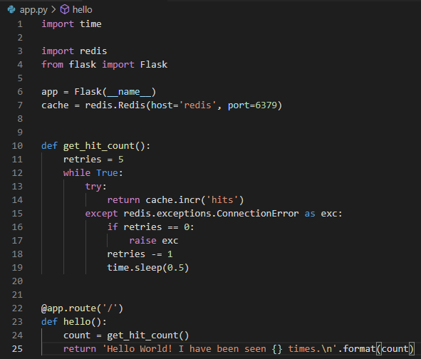

3. Membuat file requirements.txt

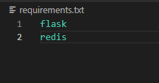

4. Membuat Dockerfile.

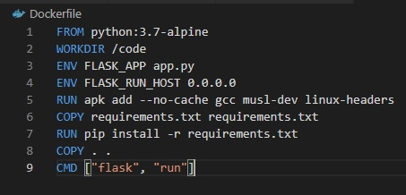

5. Define services pada Compose file.

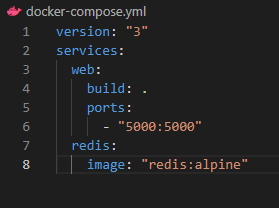

6. Menjalankan perintah docker-compose up.

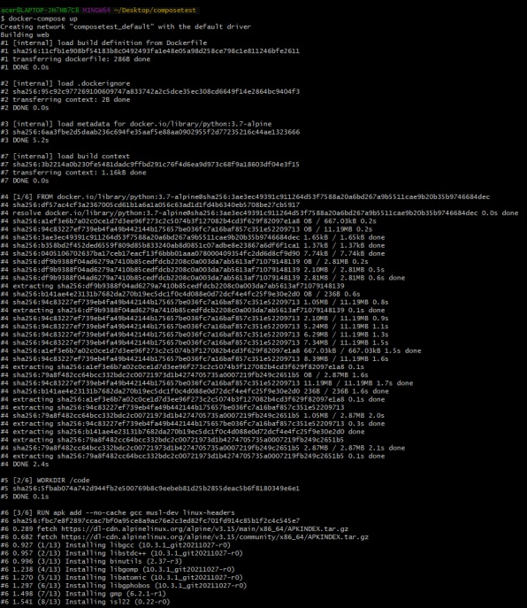

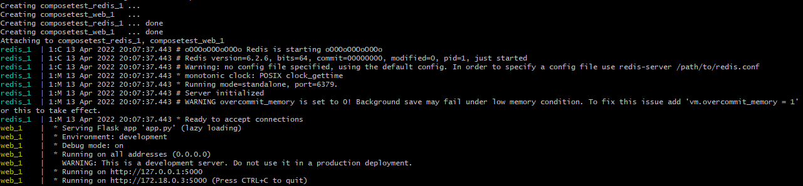

Jalankan aplikasi dengan cara:
Masukkan perintah $ docker-compose up.

7. Membuka url http://localhost:5000/ untuk melihat hasilnya.

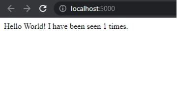

8. Refresh halaman.

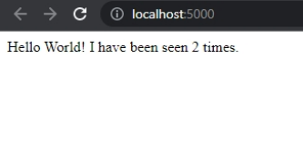

9. Membuka terminal lain dan menjalankan perintah $ docker image ls.

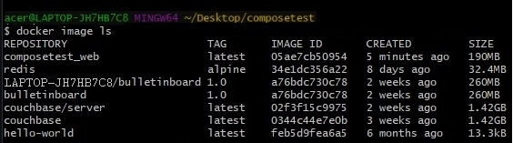

10. Edit Compose file untuk menambahkan bind mount.

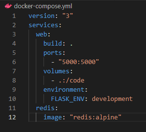

11. Re-build and run the app with Compose dengan menjalankan perintah docker-compose up.

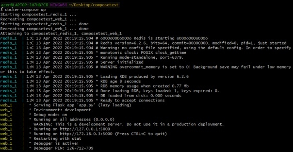

12. Cek pada browser.

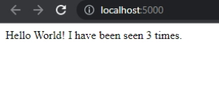

13. Update the application dan merubah file app.py

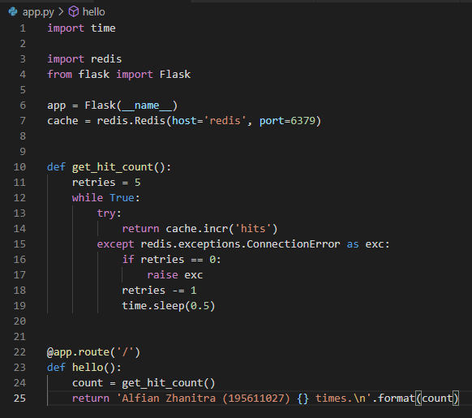

14. Mengecek hasilnya pada browser.

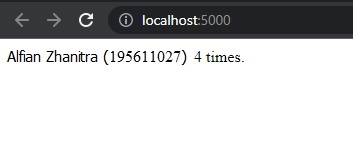

15. Experiment with some other commands dan menjalankan perintah docker lainnya.

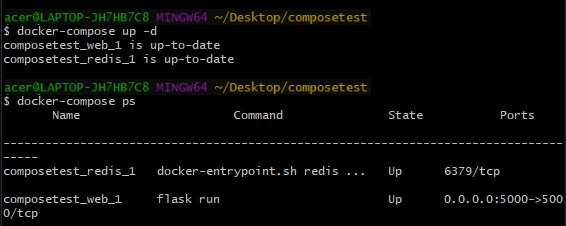

Jalankan perintah $ docker-compose up -d seperti gambar diatas untuk menjalankan aplikasi pada latar belakang.
Jalankan perintah $ docker-compose ps sperti gambar diatas untuk melihat aplikasi yang sedang berjalan.

16. Menjalankan perintah docker lainnya.

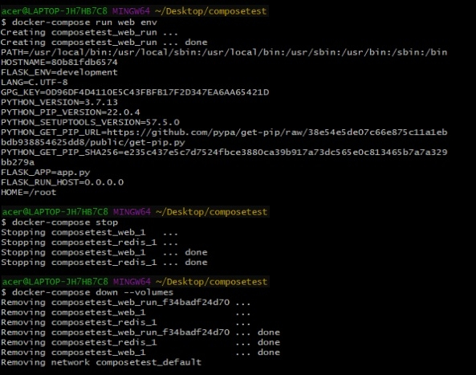

Jalankan perintah $ docker-compose run web env seperti gambar diatas untuk menjalankan dan melihat variabel yang tersedia.
Jalankan perintah $ docker-compose stop seperti gambar diatas untuk menghentikan aplikasi.
Jalankan perintah $ docker-compose down –volumes seperti gambar diatas untuk menghapus containers.