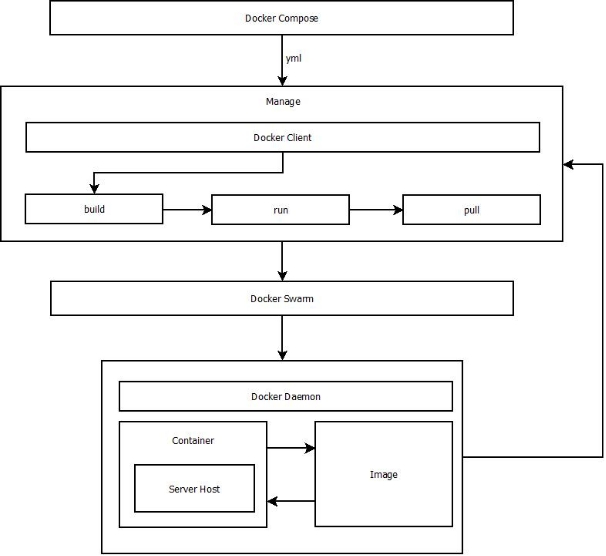

# TUGAS

Pada diagram tersebut docker compose dapat menerima request dari file yml sehingga feedback yang diberikan dengan membaca file yml dan mengirim ke manage docker client, dimana cli dapat melakukan deklarasi build dan kemudian melakukan running dan dapat melakukan pull terhadap image container nanti.

Apabila proses manage pada docker client melakukan request maka terlebih dahulu melalui docker swarm untuk melakukan pengelompokan terhadap request yang diberikan kemudian akan dilanjutkan ke dockerd/docker daemond, dimana pada docker dameond image dan container saling mengirim dan menerima feedback untuk selanjutnya memberikan feedback kepada docker cli untuk melakukan manage ulang terhadap kesalahan.