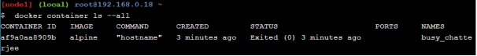

# LATIHAN

## Login Akun Docker

Lakukan proses login terlebih dahulu menggunakan akun Docker kita untuk dapat mengakses terminal linux pada web ini.

## Task 0: Prerequisites
Meng-clone repo dari github dengan nama linux_tweet_app pada akun dockersamples.

## Task 1: Run some simple Docker containers
## Run a single task in an Alpine Linux container
1. Memulai container baru dengan image alpine

2. Melihat daftar semua container yang ada

## Run an interactive Ubuntu container
1. Menjalankan Docker container dan mengakses terminal ubuntu

2. Menjalankan perintah berikut.

Jalankan perintah $ ls / untuk menampilkan daftar folder atau file yang ada.

Jalankan perintah $ ps aux untuk menampilkan proses container yang sedang berjalan.

Jalankan perintah $ cat /etc/issue untuk menampilkan distro linux yang container yang digunakan.

3. Keluar dari terminal ubuntu

4. Cek versi host VM

## Run a background MySQL container
1. Menjalankan MySQL container

2. Melihat daftar container

3. Cek log dan proses yang berjalan didalam container

4. Melihat versi MySQL yang digunakan

5. Menghubungkan terminal ke sh

## Task 2: Package and run a custom app using Docker
## Build a simple website image
1. Berpindah ke direktori repo yang telah di-clone sebelumnya

Jalankan perintah $ cat Dockerfile untuk melihat isi dari Dockerfile.

2. Mengexport variabel dockerid dengan isian id docker kita

Jalankan perintah $ echo $DOCKERID untuk menampilkan isi dari variabel dockerid.

3. Membuat docker image

4. Menjalankan container untuk menghosting image yang telah dibuat

5. Mengecek hasilnya dengan menekan link yang telah disediakan

6. Menghentikan dan menghapus container lalu mengeceknya

## Task 3: Modify a Running Website
## Start our web app with a bind mount
1.Menjalankan container untuk meng-hosting image yang telah dibuat

2. Mengecek bahwasanya image berhasil di hosting dengan menekan link yang telah disediakan

## Modify the running website
1. Meng-copy index.html container dan merefresh web untuk melihat hasilnya

2. Menghentikan dan menghapus container dan mengeceknya

## Update the image
1. Membuat image baru

2. Melihat daftar image yang ada

## Test the new version
1. Menjalankan container dan melihat hasilnya

2. Menjalankan container lainnya dan melihat hasilnya

## Push your images to Docker Hub
1. Melihat daftar image yang telah di hosting

2. Sebelumnya login menggunakan akun docker kita agar tepat dan lancar di push atau upload pada akun docker kita

3. Push image versi 1.0 dan 2.0

4. Melihat hasil image yang telah di push pada akun docker hub kita masing-masing, dengan cara: https://hub.docker.com/r/<your docker id>/

