# LATIHAN

## Login Akun Docker

Login terlebih dahulu menggunakan akun Docker kita untuk dapat mengakses terminal linux pada web ini.

## Section #1 - Networking Basics

Step 1: The Docker Network Command

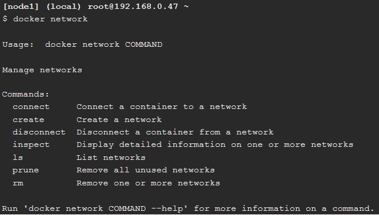

$ docker network
Merupakan perintah utama untuk konfigurasi dan mengelola container networks.

Step 2: List networks

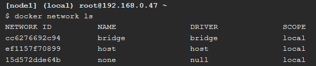

$ docker network ls
Merupakan perintah untuk menampilkan daftar container networks.

Step 3: Inspect a network

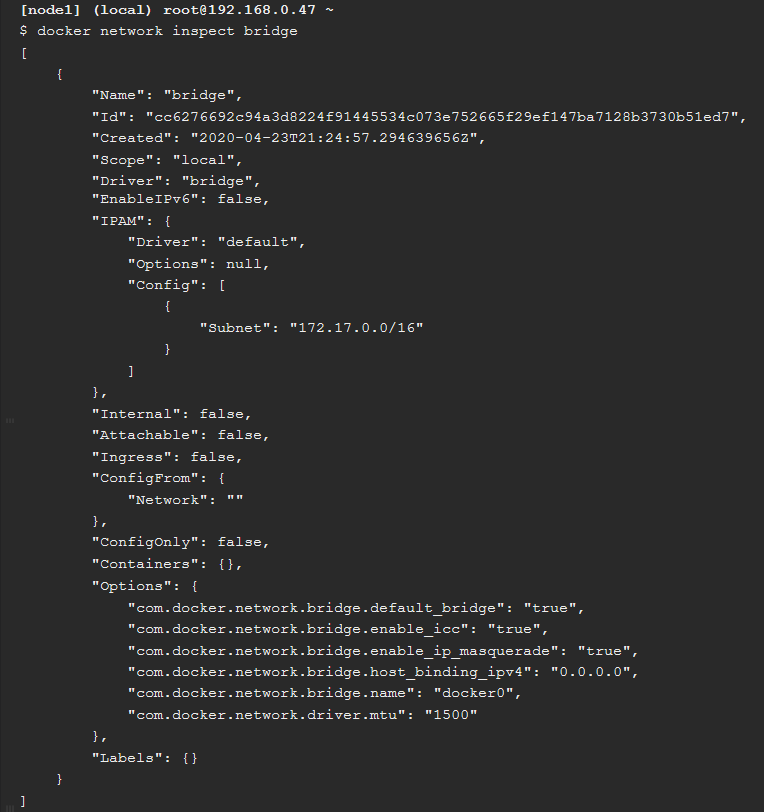

$ docker network inspect bridge
Merupakan perintah untuk melihat detail konfigurasi jaringan.

Step 4: List network driver plugins

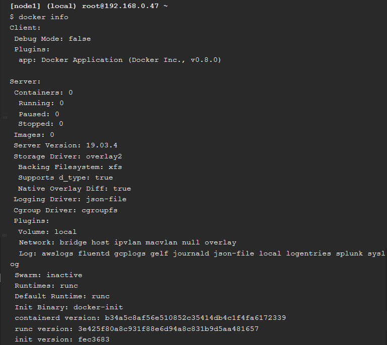

$ docker info
Merupakan perintah untuk melihat informasi mengenai installasi Docker.

## Section #2 - Bridge Networking

Step 1: The Basics

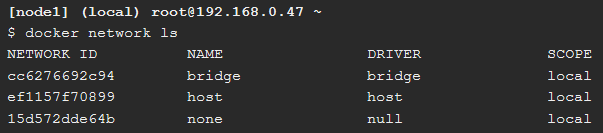

$ docker network ls
Merupakan perintah untuk menampilkan daftar container networks.

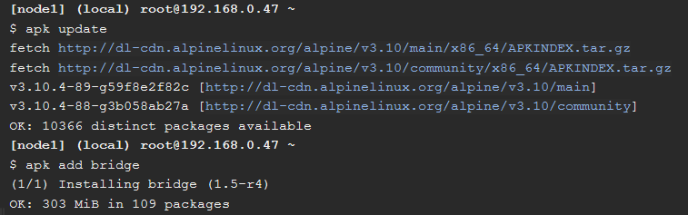

$ apk update
Merupakan perintah untuk meng-update dan install packages bridge-utils.

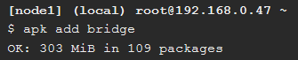

$ apk add bridge
Merupakan perintah untuk menambahkan packages bridge-utils.

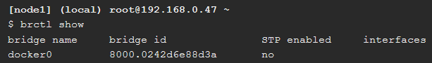

$ brctl show
Merupakan perintah untuk menampilkan daftar bridges pada Docker host.

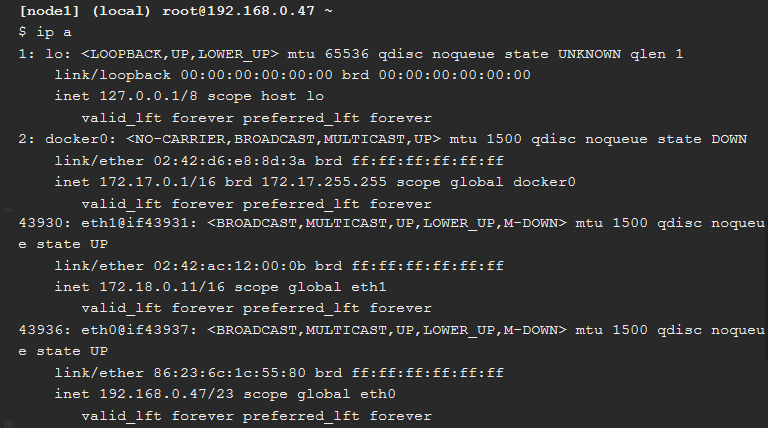

$ ip a
Merupakan perintah untuk melihat detail bridge.

Step 2: Connect a container

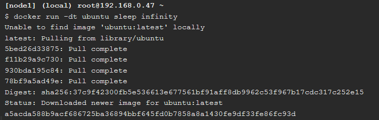

$ docker run -dt ubuntu sleep infinity
Merupakan perintah untuk membuat container baru.

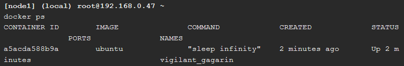

$ docker ps
Merupakan perintah untuk melihat spek container network.

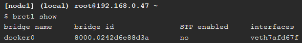

$ brctl show
Merupakan perintah untuk menampilkan daftar bridges pada Docker host.

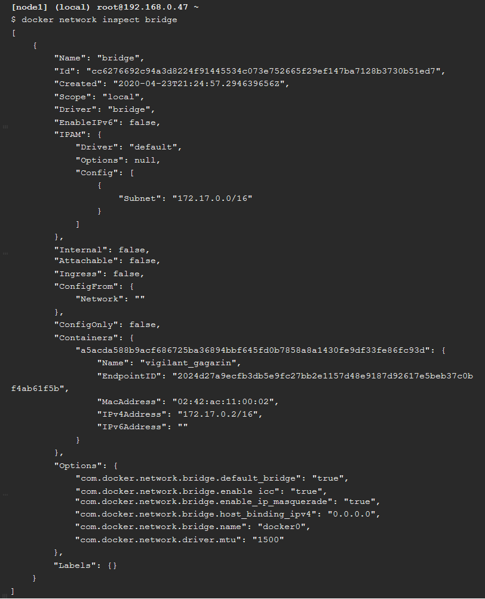

$ docker network inspect bridge
Merupakan perintah untuk menampilkan lampiran pada container bridge.

Step 3: Test network connectivity

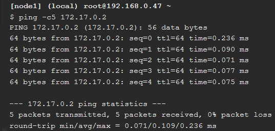

$ ping -c5 172.17.0.2
Tes jaringan (ping).

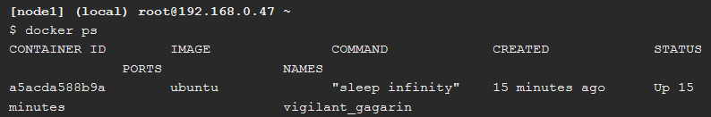

$ docker ps
Merupakan perintah untuk melihat spek container network.

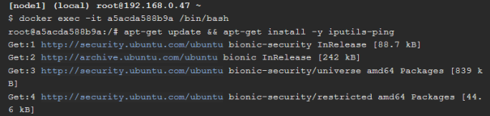

$ docker exec -it yourcontainerid /bin/bash
Merupakan perintah untuk masuk terminal ubuntu.

$ apt-get update && apt-get install -y iputils-ping
Menginstall program ping.

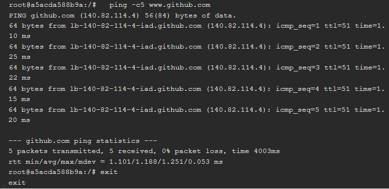

$ ping -c5 www.github.com
Tes jaringan (ping).

$ exit
Merupakan perintah untuk keluar dari terminal ubuntu.

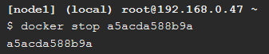

$ docker stop (id container)
Menghentikan container yang sedang berjalan.

Step 4: Configure NAT for external connectivity

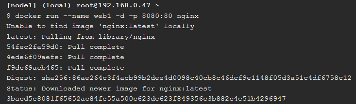

$ docker run --name web1 -d -p 8080:80 nginx
Menjalankan container baru dari official NGINX image.

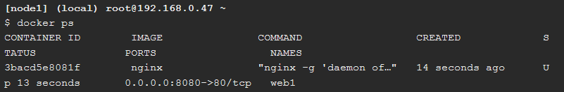

$ docker ps
Merupakan perintah untuk melihat spek container network.

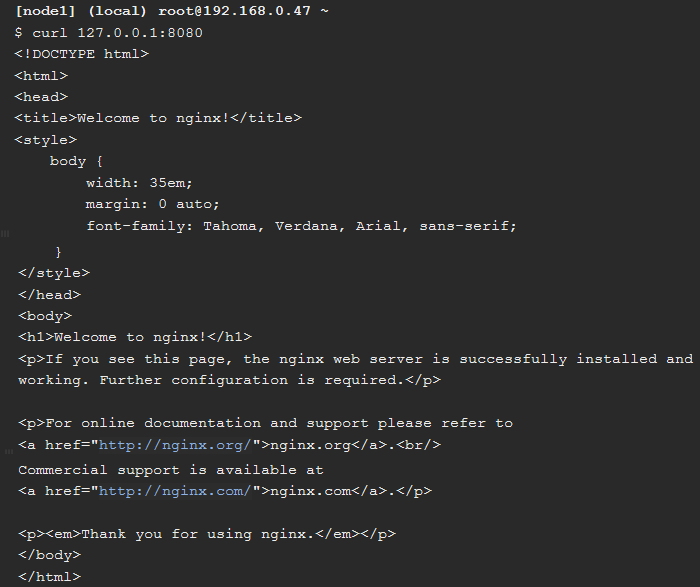

$ curl 127.0.0.1:8080
Merupakan perintah untuk menghubungkan ke docker host.

## Section #3 - Overlay Networking

Step 1: The Basics

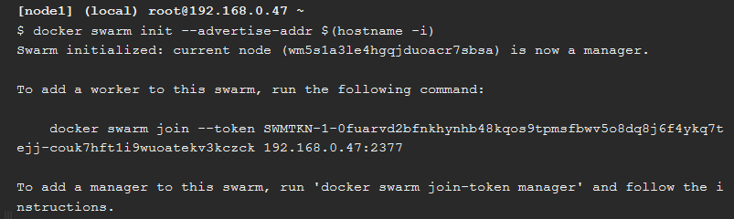

$ docker swarm init --advertise-addr $(hostname -i)
Merupakan perintah untuk menginisialisasi docker swarm baru.

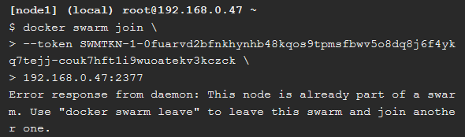

$ docker swarm join \
> --token SWMTKN-1-69b2x1u2wtjdmot0oqxjw1r2d27f0lbmhfxhvj83chln1l6es5-37ykdpul0vylenefe2439cqpf \
> 192.168.0.47:2377
Menggabungkan node.

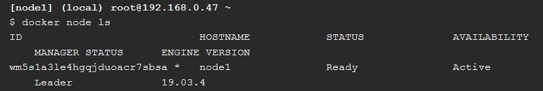

$ docker node ls
Merupakan perintah untuk melihat daftar node.

Step 2: Create an overlay network

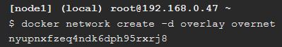

$ docker network create -d overlay overnet
Membuat sebuah overlay network.

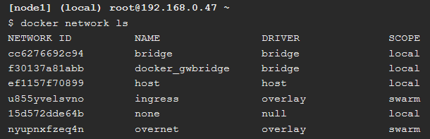
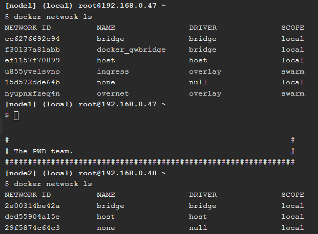

$ docker network ls
Mengecek/menampilkan network.

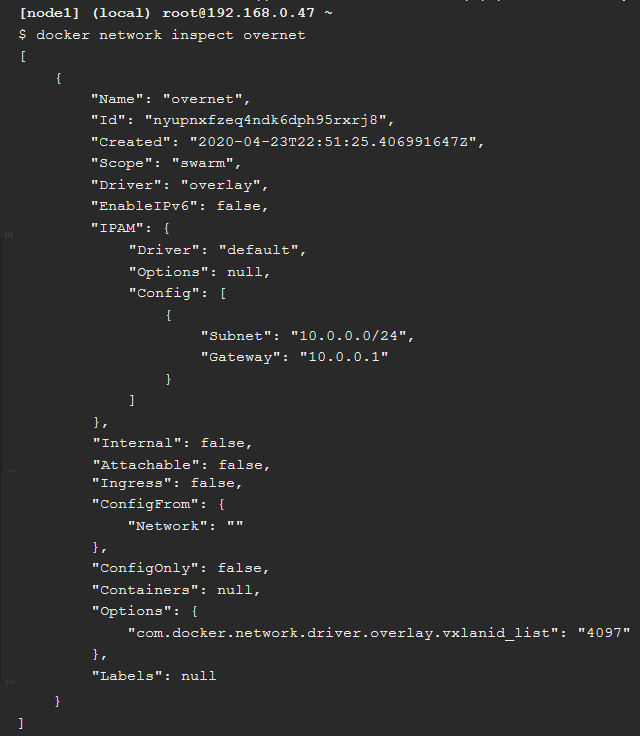

$ docker network inspect overnet
Merupakan perintah untuk melihat lebih detail informasi mengenai overnet network.

Step 3: Create a service

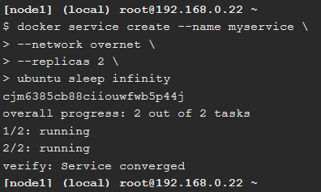

$ docker service create --name myservice \
--network overnet \
--replicas 2 \
Membuat layanan baru.

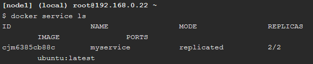

$ docker service ls
Merupakan perintah untuk cek/menampilkan daftar layanan.

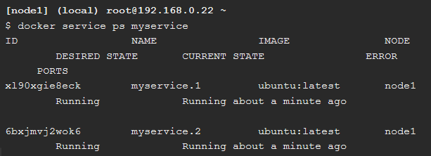

$ docker service ps myservice
Merupakan perintah untuk melihat daftar layanan yang sedang berjalan.

$ docker network ls
Mengecek/menampilkan network.

Step 4: Test the network

$ docker network inspect overnet
Merupakan perintah untuk melihat lebih detail informasi mengenai overnet network.

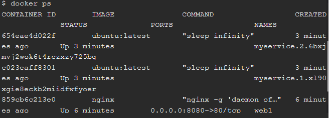

$ docker ps
Melihat spek container network.

## Cleaning Up

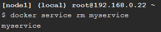

$ docker service rm myservice
Merupakan perintah untuk menghapus layanan.

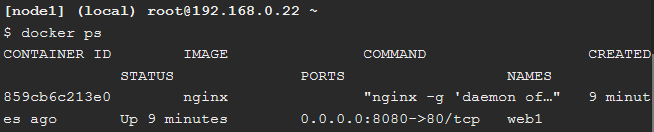

$ docker ps
Merupakan perintah untuk melihat spek container network.

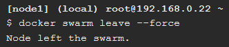

$ docker swarm leave --force
Merupakan perintah untuk menghapus node.