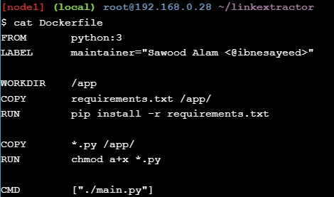
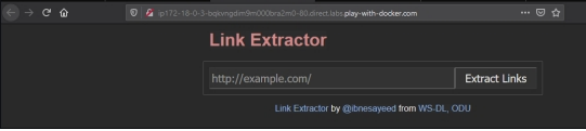

# LATIHAN

## Login Akun Docker

Login terlebih dahulu menggunakan akun Docker kita untuk dapat mengakses terminal linux pada web ini.

## Stage Setup

$ git clone https://github.com/ibnesayeed/linkextractor.git
Merupakan perintah untuk meng-clone repository dari url github.

$ cd linkextractor
Perintah untuk berpindah ke direktori linkextractor.

$ git checkout demo
Perintah untuk berpindah ke branch demo.

## Step 0 : Basic Link Extractor Script

$ git checkout step0
Merupakan perintah untuk berpindah ke branch step0.

$ tree
Perintah untuk menampilkan struktur folder.

$ cat linkextractor.py
Merupakan perintah untuk menampilkan isi file linkextractor.py.

$ ./linkextractor.py http://example.com/
Perintah untuk menjalankan file linkextractor.py.

$ ls -l linkextractor.py
Merupakan perintah untuk melihat hak/izin akses file linkextractor.py.

$ python linkextractor.py
Perintah untuk menjalankan file linkextractor.py.

## Step 1 : Containerized Link Extractor Script

$ git checkout step1
Merupakan perintah untuk berpindah ke branch step1.

$ tree
Perintah untuk menampilkan struktur folder.

$ cat Dockerfile
Merupakan perintah untuk menampilkan isi file Dockerfile.

$ docker image build -t linkextractor:step1 .
Perintah untuk membuat image.

$ docker image ls
Perintah untuk menampilkan daftar image.

$ docker container run -it --rm linkextractor:step1 http://example.com/
Perintah untuk menjalankan container.

$ docker container run -it --rm linkextractor:step1 https://training.play-with-docker.com/
Merupakan perintah untuk menjalankan container.

## Step 2 : Link Extractor Module with Full URI and Anchor Text

$ git checkout step2
Merupakan perintah untuk berpindah ke branch step2.

$ tree
Perintah untuk menampilkan struktur folder.

$ cat linkextractor.py
Merupakan perintah untuk menampilkan isi file linkextractor.py.

$ docker image build -t linkextractor:step2 .
Merupakan perintah untuk membuat image.

$ docker image ls
Perintah untuk menampilkan daftar image.

$ docker container run -it --rm linkextractor:step2 https://training.play-with-docker.com/
Merupakan perintah untuk menjalankan container.

$ docker container run -it --rm linkextractor:step1 https://training.play-with-docker.com
Perintah untuk menjalankan container.

## Step 3 : Link Extractor API Service

$ git checkout step3
Merupakan perintah untuk berpindah ke branch step3.

$ tree
Perintah untuk menampilkan struktur folder.

$ cat Dockerfile
Merupakan perintah untuk menampilkan isi file Dockerfile.

$ cat main.py
Merupakan perintah untuk menampilkan isi file main.py.

$ docker image build -t linkextractor:step3 .
Merupakan perintah untuk membuat image.

$ docker container run -d -p 5000:5000 --name=linkextractor linkextractor:step3
Merupakan perintah untuk menjalankan container.

$ docker container ls
Perintah untuk menampilkan daftar container.

$ curl -i http://localhost:5000/api/http://example.com/
Merupakan perintah untuk membuat permintaan HTTP.

$ docker container logs linkextractor
Merupakan perintah untuk melihat catatan container.

$ docker container rm -f linkextractor
Perintah untuk menghapus container.

## Step 4 : Link Extractor API and Web Front End Services

$ git checkout step4
Merupakan perintah untuk berpindah ke branch step4.

$ tree
Perintah untuk menampilkan struktur folder.

$ cat docker-compose.yml
Merupakan perintah untuk menampilkan isi file docker-compose.yml.

$ cat www/index.php
Merupakan perintah untuk menampilkan isi file www/index.php

$ docker-compose up -d –build
Merupakan perintah untuk menjalankan layanan docker compose.

$ docker container ls
Merupakan perintah untuk menampilkan daftar container.

$ curl -i http://localhost:5000/api/http://example.com/
Perintah untuk menghubungakan dengan layanan API.

Mengakses web link extractor

$ sed -i 's/Link Extractor/Super Link Extractor/g' www/index.php
Perintah untuk memodifikasi index file link extractor.

$ git reset --hard
Merupakan perintah untuk me-reset atau mengembalikan perubahan.

$ docker-compose down
Perintah untuk menghentikan layanan.

## Step 5 : Redis Service for Caching

$ git checkout step5
Merupakan perintah untuk berpindah ke branch step5.

$ tree
Perintah untuk menampilkan struktur folder.

$ cat www/Dockerfile
Perintah untuk menampilkan isi file www/Dockerfile.

$ cat api/main.py
Merupakan perintah untuk menampilkan isi file api/main.py.

$ cat docker-compose.yml
Perintah untuk menampilkan isi file docker-compose.yml.

$ docker-compose up -d –build
Perintah untuk menjalankan layanan.

Mengakses web Link Extractor

$ docker-compose exec redis redis-cli monitor
Merupakan perintah untuk membuaka client redis.

$ sed -i 's/Link Extractor/Super Link Extractor/g' www/index.php
Perintah untuk memodifikasi index file link extractor.

$ git reset --hard
Merupakan perintah untuk mereset atau mengembalikan perubahan.

$ docker-compose down
Perintah untuk menghentikan layanan.

## Step 6 : Swap Python API Service with Ruby

$ git checkout step6
Merupakan perintah untuk berpindah ke branch step6.

$ tree
Perintah untuk menampilkan struktur folder.

$ cat api/linkextractor.rb
Perintah untuk menampilkan isi file api/linkextractor.rb.

$ cat api/Dockerfile
Merupakan perintah untuk menampilkan isi file api/Dockerfile.

$ cat docker-compose.yml
Perintah untuk menampilkan isi file docker-compose.yml.

$ docker-compose up -d –build
Merupakan perintah untuk menjalankan layanan.

$ curl -i http://localhost:4567/api/http://example.com/
Merupakan perintah untuk menghubungkan layanan.

Mengakses web link extractor

Menguji sebuah url untuk di extract

$ docker-compose down
Merupakan perintah untuk menghentikan layanan.

$ cat logs/extraction.log
Perintah untuk melihat catatan sebuah web yang telah di extract.