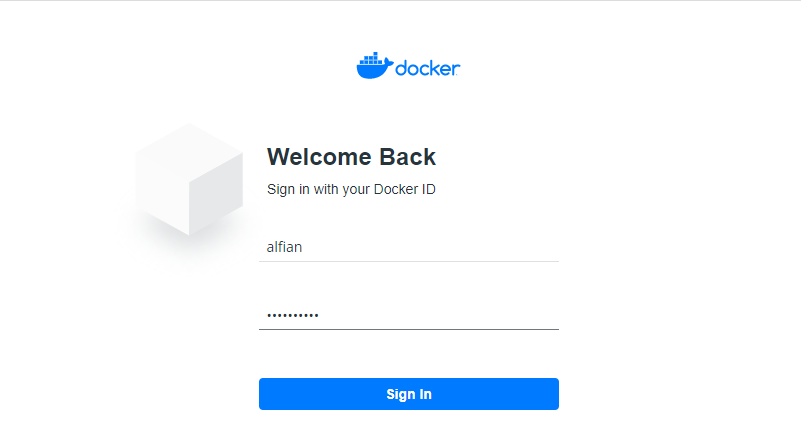

# LATIHAN

## Login Akun Docker

Login terlebih dahulu menggunakan akun Docker kita untuk dapat mengakses terminal linux pada web ini.

## Section 1: What is Orchestration

Orchestration is probably best described using an example. Let’s say that you have an application that has high traffic along with high-availability requirements. Due to these requirements, you typically want to deploy across at least 3+ machines, so that in the event a host fails, your application will still be accessible from at least two others. Obviously, this is just an example and your use-case will likely have its own requirements, but you get the idea.
Deploying your application without Orchestration is typically very time consuming and error prone, because you would have to manually SSH into each machine, start up your application, and then continually keep tabs on things to make sure it is running as you expect.
But, with Orchestration tooling, you can typically off-load much of this manual work and let automation do the heavy lifting. One cool feature of Orchestration with Docker Swarm, is that you can deploy an application across many hosts with only a single command (once Swarm mode is enabled). Plus, if one of the supporting nodes dies in your Docker Swarm, other nodes will automatically pick up load, and your application will continue to hum along as usual.

## Section 2: Configure Swarm Mode

1. Membuat container baru pada terminal node1.

Disini menggunakan container terbaru dari ubuntu.

2. Melihat daftar container untuk memastikan bahwa container telah berhasil dibuat.

### Step 2.1 - Create a Manager node

3. Menginisialisasi docker swarm.

Disini kita mendapatkan token untuk menggabungkan dengan node lain nantinya.

4. Melihat informasi docker swarm pada node1.

Node1 merupakan node untuk memanajemen node lainnya.

### Step 2.2 - Join Worker nodes to the Swarm

5. Menggabungkan node2 dan node3 kedalam swarm node1 dengan menggunakan token yang telah didapatkan sebelumnya.

Disini node2 dan node3 telah bergabung dengan swarm node1 sebagai Worker nodes.

6. Melihat daftar node yang ada beserta keterangannya.

## Section 3: Deploy applications across multiple hosts

### Step 3.1 - Deploy the application components as Docker services

7. Mendeploy container.

8. Memastikan bahwa container telah berhasil di deploy.

## Section 4: Scale the application

9. Menjalankan layanan yang sama dengan skala 7.

10. Melihat layanan yang sedang berjalan.

11. Menjalankan kembali layanan yang sama namun dengan skala 4.

12. Melihat kembali layanan yang sedang berjalan.

## Section 5: Drain a node and reschedule the containers

13. Melihat daftar node yang ada.

14. Melihat daftar container.

15. Melihat kembali daftar node yang ada.

16. Mengubah availability node 2 menjadi drain.

17. Mengecek hasilnya.

18. Melihat container yang sedang berjalan pada node2.

Disini kosong karena node2 availability sebelumnya telah diubah menjadi drain.

19. Melihat layanan yang sedang berjalan.

Disini terlihat bahwasanya layanan yang menggunakan node2 terhenti karena sama seperti sebelumnya tadi.

## Cleaning Up

20. Menghapus layanan.

21. Melihat daftar container yang ada.

22. Menghapus container.

23. Menghapus swarm pada node1, 2 dan 3.

