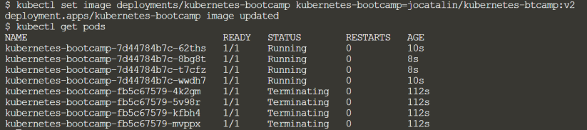
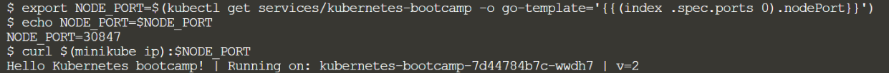

# LATIHAN

1. Membuat sebuah cluster Kubernetes

Disini kita melakukan pengecekan versi minikube, menjalankan minikube dan juga versi cluster serta informasi detailnya.

2. Mendeploy aplikasi

Disini kita melakukan deploy pada aplikasi dan mengeceknya.

3. Mengexplore aplikasi

Disini kita melakukan pengecekan konfigurasi aplikasi, menampilkan app pada terminal.
Melihat catatan containers dan mengeksekusi perintah pada container.

4. Mengekpos aplikasi ke public

Disini kita membuat sebuah servicel/layanan baru, menggunakan label dan menghapus service/layanan.

5. Pen-skalaan aplikasi

Disini kita mengecek skala aplikasi yang telah di deploy, memuat keseimbangan dan melakukan scaling down.

6. Memperbarui aplikasi

Disini kita melakukan pembaruan versi dari aplikasi, memastikan pembaruannya dan melakukakan rollback pada aplikasi yang telah di perbarui.